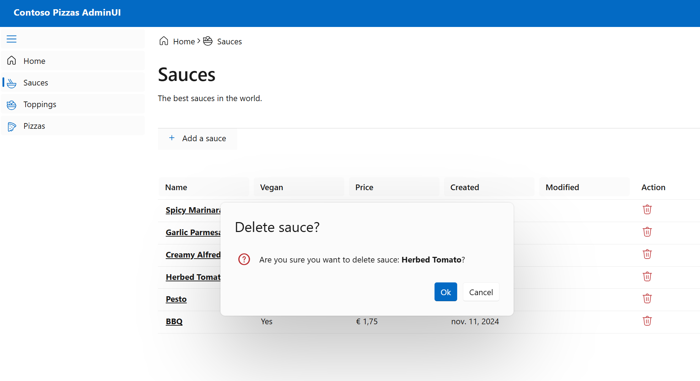

# Unit Testing with C# 

Deze solution is bedoelt om te laten zien hoe je unit tests kan schrijven in C#.

## Applicatie
Dit is in een voorbeeld app die opgestart kan worden door in vscode de task `Start Full Stack` te runnen.

## Screenshots
Home Page

Sauce Listing

Pizza Upsert

Sauce Delete


# Credits go to:
[https://github.com/lohithgn/blazor-aspnetwebapi-efcore-sample]

# Unit Testing

## Taak1 - Unit Tests schrijven voor de PriceCalculatorService
Open de PriceCalculatorService en kijk naar de business logic die erin zit. Deze zou je met de hand vanuit de UI kunnen testen, maar dat is niet schaalbaar. Daarom gaan we unit tests schrijven.
* In de file `PriceCalculatorServiceTests.cs` staat de setup voor de tests. 

## Taak2 - Sesonal Discount
In PriceCalculatorService.cs enable de seasonal discount. 
Voeg een nieuwe test toe die kijkt of de seasonal discount werkt. 
De seasonal discount is 20% korting op de prijs van de pizza in november. 
```csharp	
    FakeTimeProvider fake = new();
    fake.SetUtcNow(new DateTimeOffset(new DateTime(2004, 8, 17)));
```

