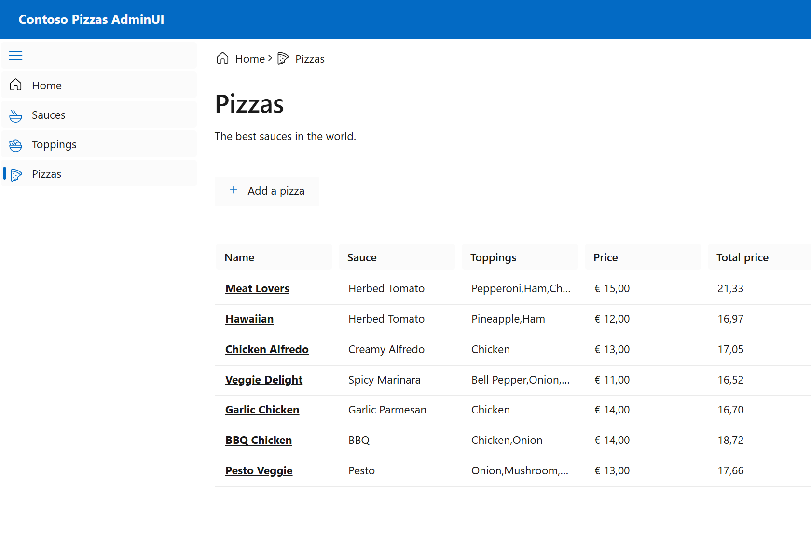

# Unit Testing with C# 

Deze solution is bedoelt om te laten zien hoe je unit tests kan schrijven in C#.

## Applicatie
Dit is in een voorbeeld app die opgestart kan worden door in vscode de task `Start Full Stack` te runnen.


## De Pizza applicatie
Home Page


Sauce Listing



Pizza Upsert


Sauce Delete


# Credits go to:
[https://github.com/lohithgn/blazor-aspnetwebapi-efcore-sample]

# Test naamgeving

Houd de volgende naamgeving aan voor de tests:

CalculatePrice_WithBasicPizza_ReturnsMinimumAmount

[MethodName] _ [Scenario] _ [ExpectedBehaviour]


# Unit Testing

## Taak1 - Unit Tests schrijven voor de PriceCalculatorService
Open de PriceCalculatorService en kijk naar de business logic die erin zit. Deze zou je met de hand vanuit de UI kunnen testen, maar dat is niet schaalbaar. Daarom gaan we unit tests schrijven.
* In de file `PriceCalculatorServiceTests.cs` staat de setup voor de tests. 


## Taak2 - Sesonal Discount
In PriceCalculatorService.cs enable de seasonal discount. 


Voeg een nieuwe test toe die kijkt of de seasonal discount werkt. 
De seasonal discount is 20% korting op de prijs van de pizza in november. 
```csharp	
    FakeTimeProvider fakeTimeProvider = new();
    fakeTimeProvider.SetUtcNow(new DateTimeOffset(new DateTime(2024, 11, 15)));
```

## Taak3 - Refactor

In `PizzaService.cs` is een `ValidatePizza` methode. Deze valideert e.e.a. over de pizza. 
Hoe krijg je deze methode getest? Hoeveel van de dependencies zijn nodig om de methode te testen?

Refactor de codebase en schrijf unit tests de `ValidatePizza` methode.

### Hint 1 
Refactor deze methode naar een nieuwe class `PizzaValidator`.

### Hint 2
Gebruik FakeItEasy om de dependencies te mocken. 
```csharp
    A.CallTo(() => _priceCalculatorService.CalculatePrice(A<PizzaEntity>._)).Returns(10);
```
### Hint 3 
Doordat de namespace ook `Pizza` heeft is het lastig om de pizza class te gebruiken.
```csharp
using DM = Contoso.Pizza.Data.Models;

new DM.Pizza { Name = "Test Pizza", Price = 2,Sauce = new() { Name = "Sauce" } };

``` 

### Hint 4
Mocht je vast lopen er zijn 2 pullrequest met voorbeeld code:

Deze voegt de `PizzaValidator` toe en een lege tests:

https://github.com/gjlubbertsen/unit-testing-by-example/pull/2/files

Deze voegt de `PizzaValidator` toe en een volledige tests:

https://github.com/gjlubbertsen/unit-testing-by-example/pull/1/files
